## About myself

::: columns
::: {.column width="50%"}
-   Post Doctoral Fellow at Donders Institute for Brain, Cognition and Behaviour, Radboud University, The Netherlands.\
-   Developing and using machine learning models to create normative models on large neuroimaging data sets.
-   Studying computer science.\
-   Involved in several open source and open science initiatives (OSSIG, DataTalks.club, TOPS, scikit-learn, Brainhack.org, The Turing Way).
-   Cat lover.\
:::

::: {.column width="10%"}
:::

::: {.column width="40%"}
{width="500"}
:::
:::

# Introduction to Open Code

Learning Objectives

After completing this lesson, you should be able to:

-   Define open-source software and distinguish it from closed-source software.
-   List common benefits and challenges to the production of open code and describe how researchers can respond to some of the challenges while maximizing openness when appropriate.
-   Describe the function and purpose of a Software Management Plan, and its utility as a guidebook for everyone involved in a scientific project.


## What is Code vs Software? {.incremental .scrollable}

::: {.fragment .fade-in}
Code:
:::

-   structured way of conveying information.
-   term not necessarily computer-specific.
-   high level code that a human can understand has to be compiled by a compiler into machine language (low level code) that the computer can understand.

::: {.fragment .fade-in}
Software:
:::

-   collection of programs, data, scripts and code that are bundled together and executed together.
-   Software can be open and closed.

::: {.fragment .fade-in}
Open-source software:
:::

-   distributed with its source code without cost, making it available for others to use, modify, and distribute with its original rights and permissions.
-   often transparently shared in a public repository, and sometimes maintained through collaboration.
-   the basis for a vast range of research software packages.
-   is often protected by a license that governs the sharing and the use of the software.

## History of computing

::: columns
::: {.column width="25%"}
{height="320"}
:::

::: {.column width="25%"}
{height="320"}
:::

::: {.column width="25%"}
{height="320"}
:::

::: {.column width="25%"}
{height="320"}
:::
:::

## Principles behind open code - a bit of a manifesto {.scrollable}

::: table_style
| **Principle**           | **Description**                                                                                                                                                    |
|--------------|----------------------------------------------------------|
| **Transparency**        | Whether you are developing software or solving a research problem, we all have access to the information and materials necessary for doing our best work. When these materials are accessible, we can build upon each other's ideas and discoveries. We can make more effective decisions and understand how those decisions affect us                                          |
| **Collaboration**       | When we're free to participate, we can enhance each other's work in unanticipated ways. When we can modify what others have shared, we unlock new possibilities. By initiating new projects together, we can solve problems that no one can solve alone. And when we implement open standards, we enable others to contribute in the future.                                       |
| **Share Early & Often** | Rapid prototypes can lead to rapid discoveries. An iterative approach leads to better solutions faster. When you're free to experiment, you can look at problems in new ways and seek answers in new places. You can learn by doing. |
| **Inclusivity**         |  Good ideas can come from anywhere, and the best ideas should win. Only by including diverse perspectives in our conversations can we be certain we've identified the best ideas, and good decision-makers continually seek those perspectives. We may not operate by consensus, but successful work determines which projects gather support and effort from the community                          |
| **Community**           | Communities form when different people unite around a common purpose. Shared values guide decision making, and community goals supersede individual interests and agendas.                                                            |
:::

## Types of software - is what I write, software/code? {.scrollable}

<br> You might have encountered different types of software: <br>

::: table_style
| Software type                       | Description                                                                                                                                                                                                                                       | Example                                                                                                   |
|------------------|----------------------------------|--------------------|
| General purpose Software            | produced for wide use; can be open or closed                                                                                                                                                                                                      | Linux kernel, GNU userspace, and various Linux and UNIX distributions, Browsers; Android Operating System |
| Operational/Infrastructure Software | used by data centers and large information technology facilities to provide data services                                                                                                                                                         | APIs, Web Apps                                                                                            |
| Libraries                           | generic tools for implementing well-known algorithms, providing statistical analysis, or visualization which are incorporated in other software categories; small                                                                                 | sci-kit learn, numpy, pandas, ggplot, etc.                                                                |
| Modelling and Simulation Software   | implements solutions to mathematical equations given input data and boundary conditions, or infers models from data                                                                                                                               | OpenFoam, Matlab libraries, Stan                                                                          |
| Analysis Software                   | developed to manipulate measurements or model results to visualize or gain understanding                                                                                                                                                          | R, SPSS,                                                                                                  |
| Single-Use Utility Software         | written for use in unique instances, such as making a plot for a paper, or manipulating data in a specific way. This code often uses libraries for analysis, plotting, or reading data; gets included into Open Science and Data Management Plans | plots for a paper, data analysis script                                                                   |
:::

## Exercise: Benefits and challenges of sharing code

::: columns
::: {.column width="60%"}
::: {.fragment .fade-in}
Benefits and challenges of sharing code
:::

::: mylist
-   What are (general and personal) benefits of sharing code?

-   What are (general and personal) challenges of sharing code

-   If you have shared code already: why?

-   If you have not shared code yet: why not?

-   If you find a challenge of sharing code: Can you come up with a solution?
:::
:::

::: {.column width="40%"}
{width="500"}
:::
:::

## Exercise: Benefits and challenges of sharing code

::: {.fragment .fade-in}
Benefits:
:::

::: mylist
-   papers with code are cited more often

-   increased credibility

-   portfolio

-   results of papers are reproducible

-   advancing scientific progress in general
:::

::: {.fragment .fade-in}
Challenges:
:::

::: mylist
-   maintenance

-   scooping

-   fear of errors in the code

-   more work
:::

## A simple way of getting started to share your code

Ideally, you have been committing code and software to git and Github as the project evolves.

If not:

::: columns
::: {.column width="30%"}

:::

::: {.column width="70%"}
-   Get a github account ([Learn how to use git](https://git-course.netlify.app/)).
-   Make sure your code/software is coherently structured, and well documented.
-   Upload code/software to Github.
-   Create a short Readme.md, describing the project and the execution of the code.
-   Add license.
-   Optional: Share your data if possible (if not, only share code).
-   [Example](https://github.com/predictive-clinical-neuroscience/HBR_SHASH)
:::
:::

## When Not to Share

::: columns
::: {.column width="60%"}
There are valid reasons that restrict a researcher's ability to share their complete code or software. Some of these reasons may include: <br>

-   The code contains personal data.

-   The code incorporates a country's military secrets or its dissemination violates national interests or security concerns.

-   The code incorporates intellectual property or patented data and information.

-   Institutional policies or organizational regulations do not permit the sharing of code.
:::

::: {.column width="40%"}
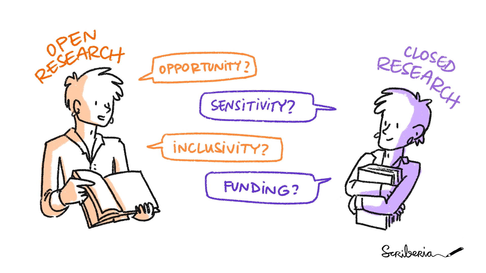{height="280"}
<small>This illustration is created by Scriberia with The Turing Way community, used under a CC-BY 4.0 licence. DOI: 10.5281/zenodo.3332807</small>

:::
:::

## Licensing code

Licensing code is a whole can of worms and I am not a lawyer.

When you make a creative work (which includes code), the work is under exclusive copyright by default. Unless you include a license that specifies otherwise, nobody else can copy, distribute, or modify your work without being at risk of take-downs, shake-downs, or litigation. Once the work has other contributors (each a copyright holder), "nobody" starts including you. <small>[Source](https://choosealicense.com/no-permission/).</small>

Licenses can range from restrictive to liberal (copy-left).

::: table_style
| Type of license               | Permissions                                                        | Examples             |
|-------------------|-----------------------------------|-------------------|
| Public domain                 | Grants all rights                                                  | CCO                  |
| Permissive license            | Grants use rights, forbids almost nothing (allows proprietization) | BSD, MIT, Apache     |
| Copyleft (protective license) | Grants use rights, forbids proprietization                         | GPL, AGPL            |
| Proprietary license           | Traditional use of copyright; no rights need be granted            | Proprietary software |
:::

## Make your code citable

::: columns

::: {.column width="40%"}
- Add a digital object identifier (DOI) to your repository, for example using Zenodo

- Add Citation.cff file to your repository
:::

::: {.column width="60%"}
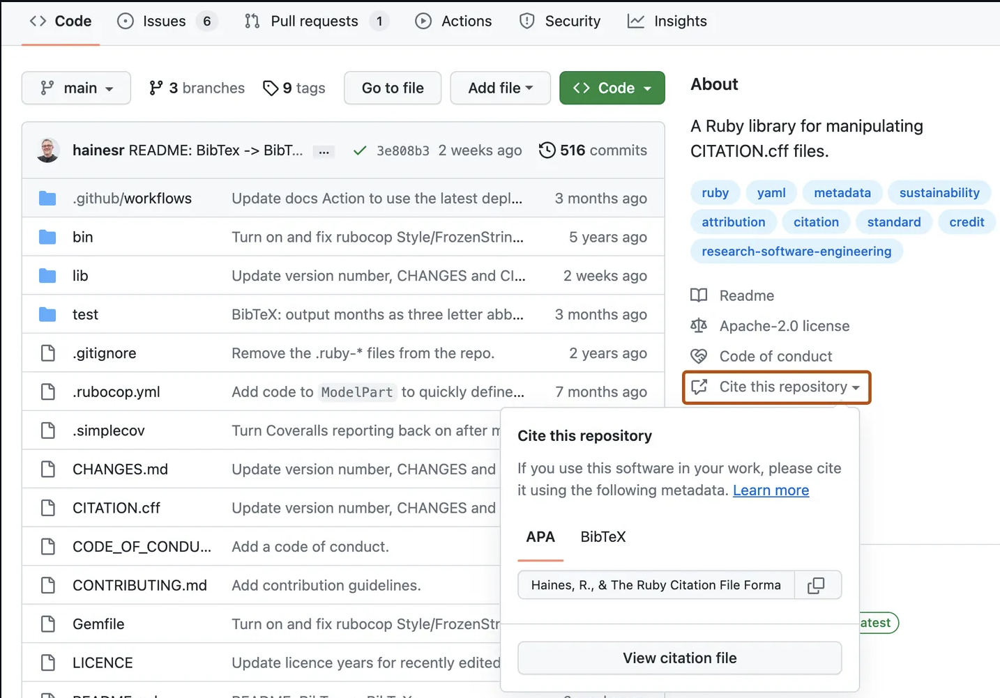
:::
::: 


::: footer
<small> [Source: Github.com](https://docs.github.com/en/repositories/managing-your-repositorys-settings-and-features/customizing-your-repository/about-citation-files) </small>
:::


## Software Management plans

::: columns
::: {.column width="40%"}

The best way to work with software.

-   Document that describes how a specific software project is developed, maintained, and curated.
-   Written by the developers, maintainers, and/or other stakeholders of a software project.
-   Goal of an SMP is to ensure that the software is usable and maintainable in the long term.

:::
::: {.column width="60%"}

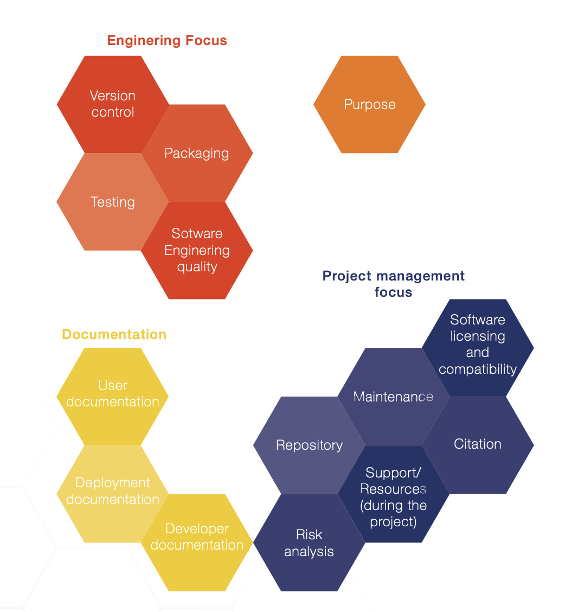{style="center" width="462"}
:::
:::

::: footer
<small> [Source: E-Science Center Netherlands](https://zenodo.org/records/7248877) </small>
:::

## Open code in the time of LLMs

::: columns
::: {.column width="60%"}
::: {.fragment .fade-in}
Code as training data:
:::
-   Large amounts of public GitHub code have been used to train LLMs (e.g. GitHub Copilot, The Stack).
-   Opt-out mechanisms exist.
-   Feeding code into commercial LLMs (e.g. ChatGPT free tier) may include it in training data. 

::: {.fragment .fade-in}
LLM-generated code and licensing:
:::
-   Code generated by LLMs is not clearly copyrightable.
-   Using LLM-generated code in a licensed repository raises unresolved legal questions.
-   Disclose LLM use in your methods when relevant.
:::

::: footer
<small> [Be careful what you tell your AI chatbot](https://hai.stanford.edu/news/be-careful-what-you-tell-your-ai-chatbot) </small>
:::


::: {.column width="40%"}
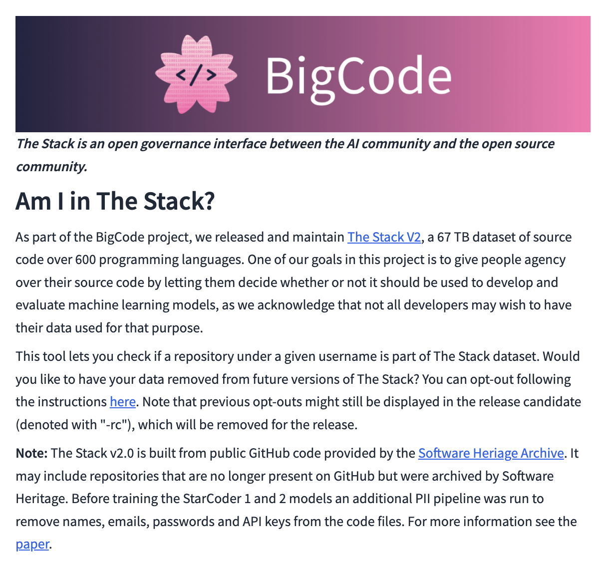{width="400"}
:::
:::

## Using LLMs for coding {.scrollable}

::: columns
::: {.column width="55%"}

::: {.fragment .fade-in }
**Should I use LLMs for coding? YES.**


::: {.fragment .fade-in}

LLMs are new: Everyone is learning how to use them. You can be a pioneer in your field by figuring out how to use them effectively and sharing your insights with others.

LLMs are fantastic teachers

-   *"Can you explain this codebase to me?"*
-   *"What does this function do?"*
-   *"Explain this method section as if I were 5."*
-   *"Give me example code to reproduce this graph."*
:::

::: {.fragment .fade-in}
**But you still need to own your code:**

::: mylist
-   Be able to read, understand, and explain it.
-   Be able to maintain and debug it.
-   **Never use LLMs on sensitive or patient data.**
:::
:::
:::
:::
:::

::: {.column width="45%"}

::: {.fragment .fade-in}
**LLMs as a leveler:**

::: mylist
- Researchers without a formal CS background, non-native English speakers, and those from under resourced institutions can now write and document code more confidently
:::
:::

::: {.fragment .fade-in}
**Getting started:**

::: mylist
-   [5-day LLM coding course (Kaggle)](https://www.kaggle.com/learn-guide/5-day-genai)
-   [AI for research (OSC)](https://courses.osc.earth/agentic-research/)
-   [DataTalks.Club courses](https://datatalks.club/)
:::
:::

:::
:::

## Tension between openness and LLMs {.scrollable}

::: columns
::: {.column width="60%"}

LLM output is probabilistic, not deterministic — unlike traditional code:

::: mylist
-   The same prompt can produce different output depending on **context**: the training data, the prompt, and the conversation history.
-   The **context window** — the amount of context the LLM can consider, measured in tokens (words or subwords) — also influences output.
-   Even sharing the exact prompt does not guarantee reproducibility.
-   This creates a genuine tension with open science principles of transparency and replication.
:::

::: {.fragment .fade-in}
**What helps:**

::: mylist
-   Share the generated code itself, not just the prompt.
-   Pin and document the model version used.
-   Test and describe what the code actually does.
:::
:::
:::


::: {.column width="40%"}

::: {.fragment .fade-in}
- Treat LLM-generated code like code from Stack Overflow: a useful starting point, but you are responsible for understanding and validating it.
:::
:::
:::

## Exercise: How do you use LLMs for coding?

::: columns
::: {.column width="60%"}

::: mylist
-   Do you use LLMs for coding? If so, how? If not, why not?
-   What benefits or challenges have you encountered?
-   Do openness and LLMs conflict or complement each other?
-   Do you have tips to share with others?
:::

:::

::: {.column width="40%"}
{width="500"}
:::
:::

## Key Takeaways: Relating Principles to Benefits and Challenges

<br>

::: {.incremental style=".mylist"}
-   Making software more open has benefits and challenges, which are related. <br>
-   Greater benefits typically come with greater challenges.
-   In most cases, individual scientists and society will both benefit from more open software.
-   LLMs can both accelerate and hinder the coding process, and might create a tension with reproducibility
:::

# Using Open Code

Learning Objectives

After completing this lesson, you should be able to:

-   Describe the process of using open code and know some key repositories to find open code.

-   Describe how, where, and under what circumstances one should acknowledge (cite) code.

## Discovering open code

What locations do you already know where you can find code?

::: mylist
<br>

-   [Github](https://github.com/)
-   [Gitlab](https://about.gitlab.com/)
-   [Bitbucket](https://bitbucket.org/)
-   [Papers with code](https://paperswithcode.com/)
-   [The Journal of Open Source Software](https://joss.theoj.org/)
-   [Stackoverflow](https://stackoverflow.com/)
-   Reverse engineering packages
-   [Example: Apollo 11 source code](https://github.com/chrislgarry/Apollo-11)
:::

## Software repositories {.scrollable}

::: table_style
|                             |                                        |                             |                                             |
|------------------|------------------|------------------|------------------|
| 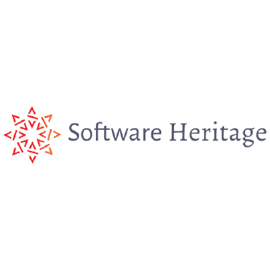 | 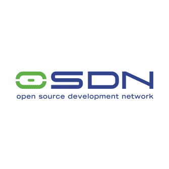            | 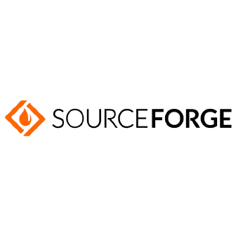 | 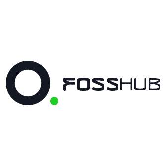                 |
| Software Heritage           | Open Source Development Network (OSDN) | SourceForge                 | Free and Open-Source Software Hub (FOSSHUB) |
| 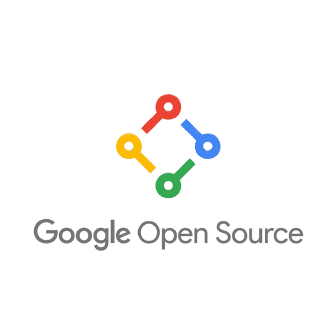 | 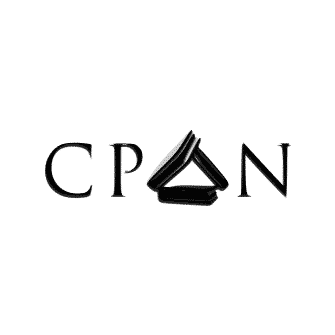            | 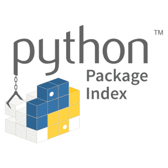 | 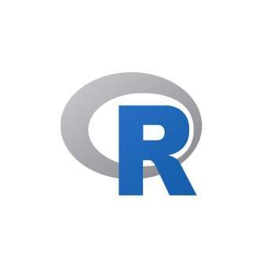                 |
| Googlecode                  | Comprehensive Perl Archive Network     | PyPl                        | CRAN                                        |

<!-- ::: -->

<!-- ## Four General Considerations for Assessing Open Software -->

<!-- <br> -->

<!-- Software assessment criteria are similar, for any level of openness: -->

<!-- <br> -->

<!-- ::: table_style -->

<!-- | VALUE                 |                                                                  | -->

<!-- |----------------------|--------------------------------------------------| -->

<!-- | Functionality         | Will it be useful for your scientific problem?                   | -->

<!-- | Interoperability      | How hard will it be to use?                                      | -->

<!-- | Security: Is it safe? | Would using the software create a security risk?                 | -->

<!-- | Licenses/restrictions | Can you use it? Is it legal to use the software in your project? | -->
:::

## What makes a good README? {.scrollable}

The README is the first thing anyone sees when they visit your repository, it determines whether your code gets used.

<br>

A good README includes:

::: mylist
-   **Title and description** — what the project does and why
-   **Installation instructions** — dependencies and setup steps
-   **Usage example** — at least one working, copy-pasteable example (if applicable). If you shared code to a paper, describe how it should be used to reproduce the paper's results.
-   **Citation** — how to credit the software in a paper (if applicable).
-   **Downloads, releases and Change log** — if applicable, describe how to get the latest version and what has changed.
-   **Contributors and acknowledgements** — who contributed to the project and who should be acknowledged (if applicable).
-   **License** — what others are allowed to do with it (if applicable).
-   **Contact / contribution info** — Contributing.md: how to contribute
:::


<br>

::: {.fragment .fade-in}
Rule of thumb: if a new lab member couldn't run your code from the README alone, it needs more work.
:::

::: footer
<small>[awesome_readme](https://github.com/matiassingers/awesome-readme)</small>
<small>[How to write an elegant README](https://www.yegor256.com/2019/04/23/elegant-readme.html)</small>
:::


## Citing Open Source Code and Software


::: {.fragment .fade-in}
**When should open code be cited?**
:::

::: mylist
-   It has played a critical part in your research.
-   It provides something novel
-   It impacts the results of your analysis
:::


::: {.fragment .fade-in}
> If you run a simulation using a specific software package, cite that package. You do not need to cite the word processor you used to write the paper. However, if your research is on comparing word processors, then you would need to cite the word processor you used. 
:::


## 10 Tips for citing software {.scrollable}


::: {.mylist style="font-size: 0.72em"}
1. Describe any software that played a critical part in your research in enough detail for a peer to repeat and validate what you did.
2. Options for citing: footnotes, acknowledgements, methods sections, and appendices.
3. A licence may place you under an obligation to attribute the software.
4. Cite papers that describe software as a **complement to**, not a replacement for, citing the software itself.
5. In the first draft, always put software citations in references or bibliographies.
6. Be prepared to debate with reviewers, you are acknowledging the contribution of the software's authors.
7. Inform reviewers if you are legally obliged to cite the software.
8. If a reviewer disagrees, you can still make a general reference in the paper.
9. Recommended citations may lack detail; add more yourself if needed.
10. If the software has a DOI, use it. Otherwise use the software's URL.
:::

::: footer
<small>[Software Sustainability Institute](https://www.software.ac.uk/publication/how-cite-and-describe-software)</small>
:::

## Citation formats {.scrollable}

::: {style="font-size: 0.78em"}

::: {.fragment .fade-in}
**Software purchased off-the-shelf:**
:::

::: mylist
-   ProductName. Version. ReleaseDate. Publisher. Location.
-   *SuperScience. 1.2. December 2012. ResearchSoftware. Edinburgh, UK.*
:::

::: {.fragment .fade-in}
**Software downloaded from the web:**
:::

::: mylist
-   ProductName. Version. ReleaseDate. Publisher. Location. DOIorURL. DownloadDate.
-   *OGSA-DAI REST. 4.2.1. December 2012. OGSA-DAI Project. http://sourceforge.net/projects/ogsa-dai. 27/04/2012.*
:::

::: {.fragment .fade-in}
**Software checked out from a public repository:**
:::

::: mylist
-   ProductName. Publisher. URL. CheckoutDate. RepositorySpecificCheckoutInformation.
-   *OGSA-DAI REST. OGSA-DAI Project. http://sourceforge.net/projects/ogsa-dai. 27/04/2012. Check-out: ogsa-dai/branch/ogsadai4.1/, revision 1657.*
:::

::: {.fragment .fade-in}
**Software on GitHub with a DOI:**
:::

::: mylist
-   Author. ProductName. Version. \[Type of Work\]. DOI/URL.
-   *Lisa, M., & Bot, H. (2017). My Research Software (Version 2.0.4) \[Computer software\]. https://doi.org/10.5281/zenodo.1234.*
:::

::: {.fragment .fade-in}
**AI tool:**
:::

::: mylist
-   AI Company Name. (year). Tool Name/Model in Italics and Title Case [Description; e.g., Large language model]. URL of the tool.

-   Anthropic. (2025). Claude 4 Sonnet [Large language model]. https://claude.ai/new
:::

::: {.fragment .fade-in}
**AI chat:**
:::

::: mylist
-   AI Company Name. (year, month day). Title of chat in italics [Description, such as Generative AI chat]. Tool Name/Model. URL of the chat

-   Anthropic. (2025, May 20). Essential grammar topics for high school graduates [Generative AI chat]. Claude Sonnet 4. https://claude.ai/share/329173b2-ec93-4663-ac68-4f65ea4f166d
:::
::: 

::: footer
<small>[APA guidelines](https://apastyle.apa.org/blog/cite-generative-ai-references)</small>

<small>[Software Sustainability Institute](https://www.software.ac.uk/publication/how-cite-and-describe-software)</small>
:::

## Exercise: Pick one

::: columns
::: {.column width="70%"}

**One concrete first step towards sharing code**
<br>

Think about a concrete example (research, project).

<br>

What are the two next concrete steps towards making your code (documentation) for this project share-able?
<br> 

**Citing your first software package**
<br>

Think about a software package you have used in your research. 

<br>
Look up the recommended citation for that package and add it to your reference manager (e.g. Zotero, Mendeley, Endnote, etc.) or your bibliography file (e.g. .bib file).
:::

::: {.column width="30%"}
{width="500"}
:::
:::

## Thank you so much!

<br><br>

[This presentation is reproducible!](https://github.com/likeajumprope/TOPS_talk_open_software)

<br> <br>

```{r, echo=TRUE}
a = "Thank you!"
b = "What Questions Do You Have?"

print(paste(a, b))
```

::: footer
Contact me on Github, X: (at)likeajumprope
:::
